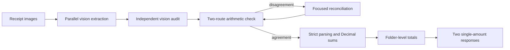

# FTEC5660 Homework 1: Receipt Chain

Build a LangChain pipeline that reads every supermarket receipt in a folder
with the vision-capable DeepSeek Flash model and answers these two questions:

1. How much money did I spend in total for these bills?
2. How much would I have had to pay without the discount?

For this homework, **amount spent** means the final payment after the receipt's
rounding line. **Without the discount** means the sum of the original positive
item prices: add back every promotion, coupon, member, app, packaging-damage,
and percentage discount, but do not add back rounding.

## Student task

Only edit the two functions in `hw1.py` that contain `### YOUR CODE HERE`:

- `build_chain()` creates your LangChain chain.
- `answer_queries()` runs the chain on the receipt images and returns one final
  response for each question.

You may use prompt chaining, routing, parallel calls, reflection, or a
combination. Your final responses should each contain one HKD amount. Do not
hard-code filenames or public answers; grading uses unseen receipt folders.

## Setup and public test

```bash
python3 -m venv .venv
source .venv/bin/activate
pip install -r requirements.txt
```

Put your DeepSeek key after `DEEPSEEK_API_KEY=` in `.env`, then run:

```bash
python3 hw1.py --image-folder public_test
```

The program creates `results.csv` in the current directory. Its columns are
`query`, `model_response`, and `correctness`. The public answers are in
`public_test/ground_truth.json`. The starter intentionally returns the dummy
response `please design your chain to answer these two queries.` so it runs
before you add any API code.

The required model is `deepseek-v4-flash-vision-exp`, the vision-capable
DeepSeek Flash model. JPEG, PNG, GIF, and WebP inputs are accepted by the
homework runner.


## Homework 1 solution



The solution builds two reusable LangChain pipelines around the required
`deepseek-v4-flash-vision-exp` model. Each receipt is first read independently
to identify the final payment after rounding, the discounted subtotal before
rounding, and itemized lists of every applied discount and every original
positive charge. A second vision pass audits the draft against the original
image and corrects recognition, classification, and arithmetic errors. The
discount-based total is cross-checked against the independently summed positive
charges; only inconsistent receipts receive a focused reconciliation pass.
`answer_queries()` batches receipt calls in parallel, parses
the audited JSON defensively, recomputes each undiscounted amount as subtotal
plus the absolute discount total with `Decimal`, and then sums all receipts in
Python. This keeps aggregation deterministic and guarantees that each final
response contains exactly one HKD amount.
